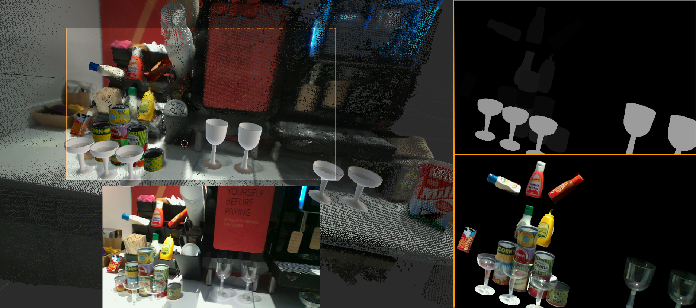
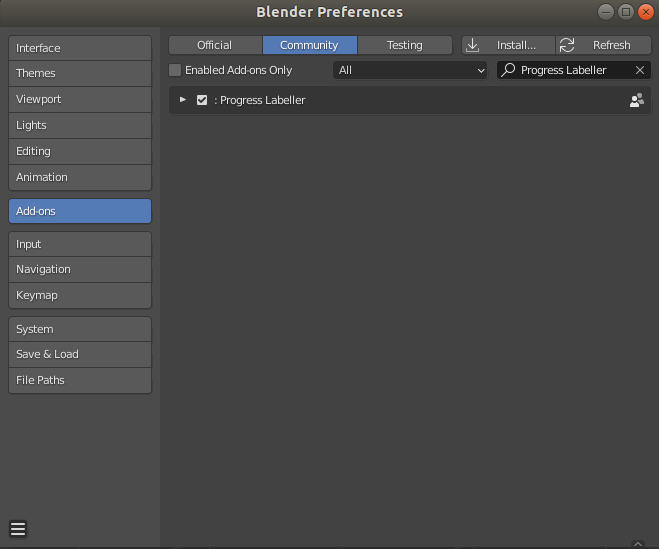
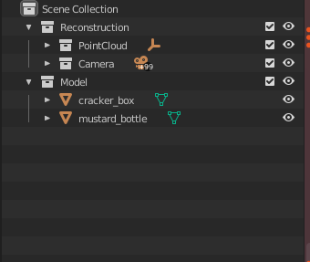
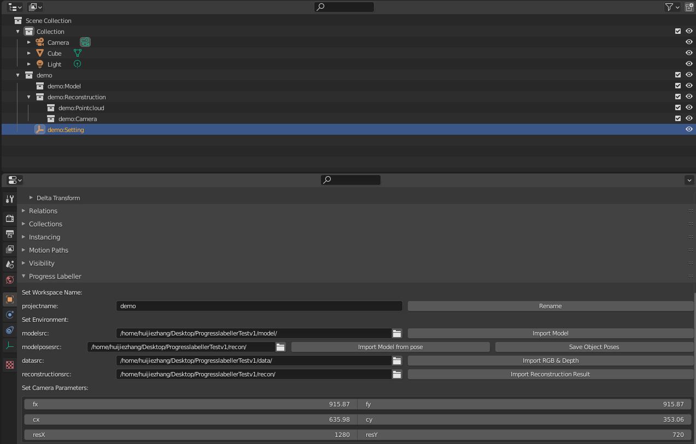
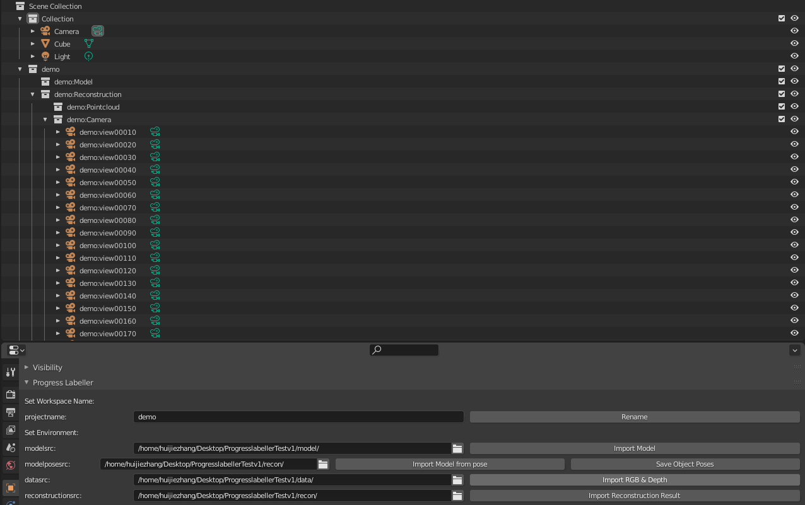
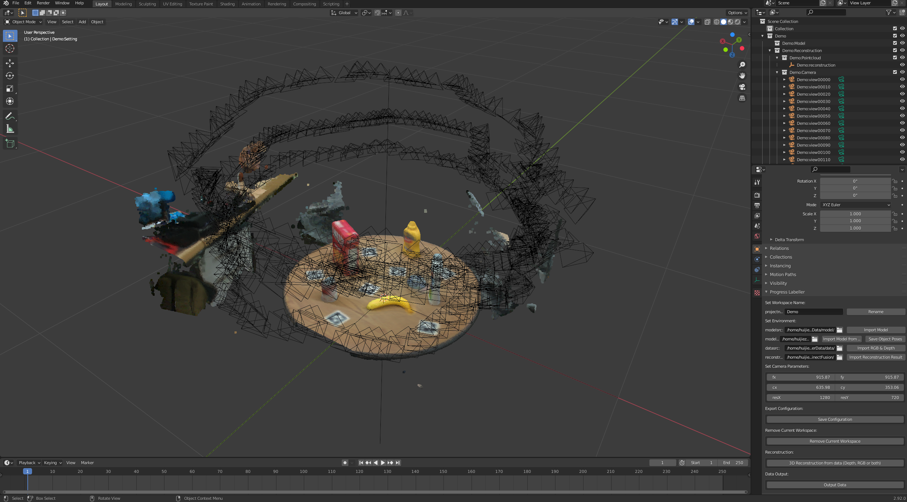
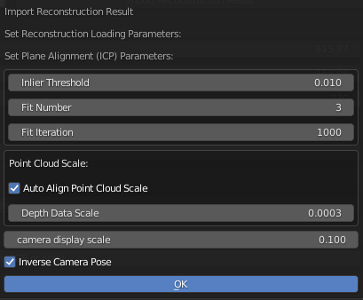

# Progress Labeller



## Overview

**This is an developing repository**. The project is an blender add-on to re-implement a pipeline, Labelfusion. Labelfusion is a pipleine to generate ground truth object-centric pose and mask labels from sequential images. It is powerful, but we find it is hard to install due to some out-of-date dependencies. Therefore, this project is trying to re-implement Labelfusion in a more user-friendly, cross-platform software, blender. Moreover, we would further improve the accuracy of Labelfusion, and make it model-free.

## Table of contents
-----
  * [Installation](#installation)
    * [Install add-on in blender](#install-add-on-in-blender)
    * [Install denpencies](#install-denpencies)
  * [Data structure](#data-structure)
    * [Dataset](#dataset)
    * [Configuration](#configuration)
    * [Collection](#collection)
  * [Quick Start](#quick-start)
    * [Reconstruction from build-in KinectFusion](#reconstruction-from-build-in-kinectfusion)
    * [Reconstruction from COLMAP](#reconstruction-from-colmap)
    * [Tools for better alignment](#tools-for-better-alignment)
  * [Reference](#references)
------

## Installation

Our blender add-on has been tested in the following environment:

* Ubuntu 18.04
* Blender 2.9.2

### Install add-on in blender

In order to see some running message about our pipeline, it is recommended to run the blender in the terminal. Just run:
```bash
blender
```

Open ``Edit > Preferences > Install...`` in blender, search ``PATH/TO/REPO/ProgressLabeller.zip`` and install it. After successful installation, you could see Progress Labeller in your Add-ons lists.




### Install denpencies

Our add-on depends on the following libraries:

* open3d
* Pillow
* pycuda
* scipy

It should be mentioned that blender itself use it build-in python, so be sure to install the packages in the correct way. More specific, pip install command shoudld be 
```bash
pip3 install --target /PATH/TO/BLENDER/2.92/python/lib/python3.7/site-packages open3d Pillow pycuda scipy
```

## Data structure

### Dataset

To prepare a new dataset, please follow the structure below. We also provide a **demo dataset** [here](https://www.dropbox.com/s/qrgare7rg579m48/ProgressLabellerDemoDateset.zip?dl=0)

```bash
<dataset>
|-- data              # pairwise rgb and depth images, no need for the name, just pairwise rgb and depth images 
                      # should have the same name
    |-- rgb
        |-- 0.png        
        |-- 1.png
        ...
    |-- depth
        |-- 0.png        
        |-- 1.png
        ...
|-- model
    |-- object1        # model for pose labelling, should have the same package structure
        |-- object1.obj
    |-- object2
        |-- object2.obj
    ...
|-- reconstruction package     # reconstruction result, the package name could be random, its files could either 
                               # be generated from our pipline or created from other methods.
    |-- campose.txt            # Name should be the same. Camera poses file, stored camera pose for each images
    |-- fused.ply              # Name should be the same. Reconstructed point clound
    |-- label_pose.yaml        # Name should be the same. Object poses file, stored labelled objects poses, 
                               # generated from our pipline.
    ...
|-- output                     # Stored output labelled objects poses and segmentation per frame, 
                               # generated from our pipline.
    |-- object1        
        |-- pose
            |--0.txt
            |--1.txt
            ...
        |-- rgb
            |--0.png
            |--1.png
            ...       
    |-- object2
        |-- pose
            |--0.txt
            |--1.txt
            ...
        |-- rgb
            |--0.png
            |--1.png
            ...   
     ...
```
#### Object poses file

Object pose file is a ``.yaml`` file stored all labelled pose in world coordinate. It makes it more convenient for you to re-load your labelled results. We present a demo in the given demo dataset ```PATH/TO/DEMODATASET/COLMAP_recon/label_pose.yaml```, it should be aranged as:

```bash
object1:
   pose:
   - [x, y, z]
   - [qw, qx, qy, qz]
object2:
   pose:
   - [x, y, z]
   - [qw, qx, qy, qz]
...   
```

The object name in Object pose file should be the same as the package and file name for models in ```PATH/TO/DATASET/model```, [using object pose file to import objects](#Import-object-model) would automatically search objects in ```PATH/TO/DATASET/model``` from names in object pose file.

#### Camera poses file

Object pose file is a ``.txt`` file stored camera poses for each image in ```PATH/TO/DATASET/data```. It could be generated from our pipeline (right now we use kinect fusion) or from other projects like [COLMAP](https://colmap.github.io/). We present a demo in the given demo dataset ```PATH/TO/DEMODATASET/COLMAP_recon/extracted_campose.txt```, it should be aranged as:

```bash
# IMAGE_ID, QW, QX, QY, QZ, TX, TY, TZ, CAMERA_ID, NAME

1 qw, qx, qy, qz, tx, ty, tz, 1, 0.png
...   
```

### Configuration

You could design your own configuration in a ``.json`` file, we present a demo in ```PATH/TO/DEMODATASET/configuration.json```
```python
{
    "projectname": "Demo",
    "environment":{
        "modelsrc": 
        ## path for the model
            "PATH/TO/DEMODATASET/model/",
        "modelposesrc": 
        ## path for the Object poses file
            "PATH/TO/DEMODATASET/COLMAP_recon/",
        "reconstructionsrc":
        ## path for the reconstruction package 
            "PATH/TO/DEMODATASET/COLMAP_recon/",
        "datasrc":
        ## path for the data(rgb and depth)
            "PATH/TO/DEMODATASET/data/"
        },
    "camera":{
        "resolution": [1280, 720],
        "intrinsic": [[915.869, 0, 635.981],
                      [0, 915.869, 353.060],
                      [0, 0, 1]],
        "lens": 0.025 # could be random number, no physical meaning
    },
    "reconstruction": {
       "scale": 1.0,  # scale for the reconstruction, for depth-based method, it would be 1; 
                      # for rgb-based method, we use depth information to auto-align the scale
       "cameradisplayscale": 0.1
                      # display size for the camera
      }
}
```

### Collection

We create new collections in blender for a better arrangement for our pipline, it has the following structure:

```bash

|-- Scene Collection              # root cocllection in blender
    |-- <Your project name>       # collection for your project workspace name, is same as 
                                  # the projectname in the configuration.json file
        |-- <Your project name>:Model                     
            |-- <Your project name>:object1                # model object
            |-- <Your project name>:object2
            ...
        |-- <Your project name>:Reconstruction  
            |-- <Your project name>:Pointcloud
                |-- <Your project name>:reconstruction     # point cloud object
            |-- <Your project name>:Camera
                |-- <Your project name>:view0              # camera object 
                |-- <Your project name>:view1
                ...
        |-- <Your project name>:Setting                    # setting object 
    ...
```




## Quick Start

### Reconstruction from build-in KinectFusion

#### Create Workspace
Create a new workspace ``File > New > ProgressLabeller Create New Workspace`` in blender, correctly link each path and camera intrinsic under the object properties of setting object. The model package and data package should contain datas [introduced before](#dataset) while reconstruction package could be empty.



#### Load images

Then click the ``Import RGB & Depth`` under the object properties of setting object to load RGB, depth images and cameras into your worksapce. Don't forget to do this before starting reconstruction.



#### Reconstruct

Then click the ``3D Reconstruction from data (Depth, RGB or both)`` under the object properties of setting object, select the reconstruction method as KinectFusion. Follow the guidance of (#kinectfusion-setting) to set the parameters, then start reconstruction. The process of the reconstruction would shown in the terminal.

After successful reconstruction, you would see the point cloud under the `` <Your project name>:Reconstruction`` collection and cameras with registered poses under the `` <Your project name>:Camera`` collection.



#### Align model

Then click the ``Import Model`` under the object properties of setting object to import obejct for labelling and drag models to algin the point cloud.

### Reconstruction from COLMAP

Instead of [load images](#load-images) and [reconstruct](#reconstruct) in our add-on, it is also supported to load other projects' reconstructions result. Just follow the [guidance](#dataset) to prepare the dataset, especially the [camera poses file](#camera-poses-file) and [reconstruction package](#dataset).

Then click the ``Import Model`` under the object properties of setting object to import cameras and reconstruction. It should be mentioned that COLMAP gives the inverse of the camera poses (world pose under the camera coordinate system), while build-in kinectfusion gives camera poses under the world system. When loading COLMAP result, please select ``Inverse Camera Pose``. Also, please select ``Auto Align Point Cloud Scale`` if you don't know the actual scale for the reconstruction. We would use depth information to fit the scale.



### Tools for better alignment
We prepare several tips for a better alignment.


## References
[1] Marion, Pat, Peter R. Florence, Lucas Manuelli, and Russ Tedrake. **"Label fusion: A pipeline for generating ground truth labels for real rgbd data of cluttered scenes."** In 2018 IEEE International Conference on Robotics and Automation (ICRA), pp. 3235-3242. IEEE, 2018.

