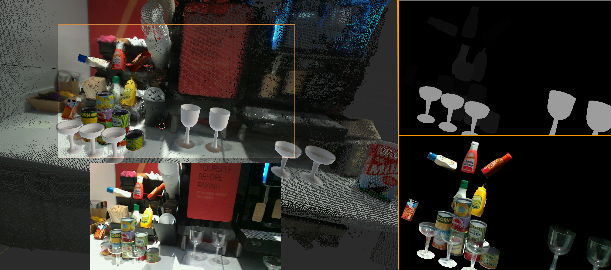
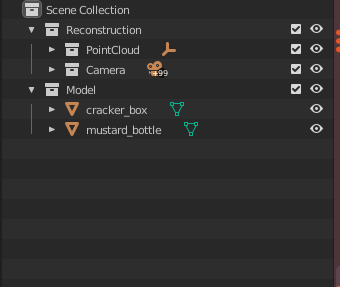
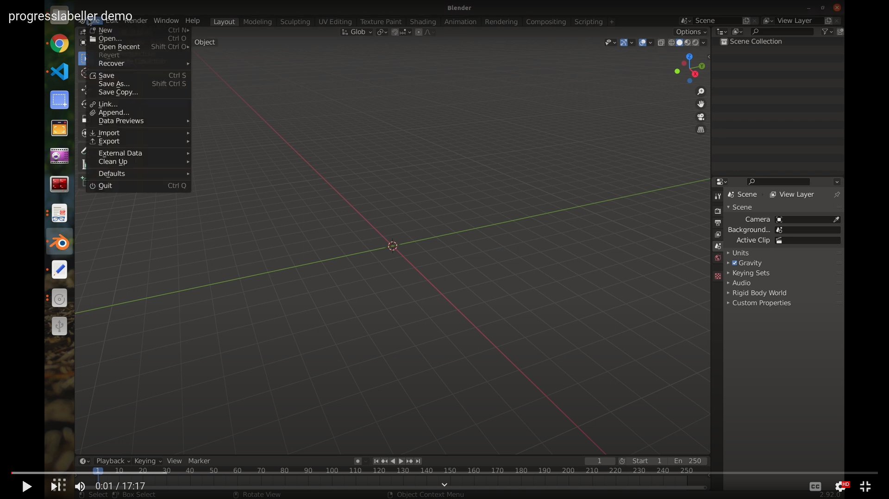

# ProgressLabeller: Visual Data Stream Annotation for Training Object-Centric 3D Perception



# Overview

ProgressLabeller is a method for more efficiently generating large amounts of 6D pose training data from color images sequences for custom scenes in a scalable manner. ProgressLabeller is intended to also support transparent or translucent objects, for which the previous methods based on depth dense reconstruction will fail. The project is an blender add-on implementation of Progresslabeller. 

If you use this project for your research, please cite: 
```bash
@article{chen2022progresslabeller,
  title={ProgressLabeller: Visual Data Stream Annotation for Training Object-Centric 3D Perception},
  author={Chen, Xiaotong and Zhang, Huijie and Yu, Zeren and Lewis, Stanley and Jenkins, Odest Chadwicke},
  journal={arXiv preprint arXiv:2203.00283},
  year={2022}
}
```


# Table of contents
-----
  * [Installation](#installation)
  * [Data structure](#data-structure)
  * [Usage](#usage)
  * [Output](#output)
  * [Reference](#references)
------

# Installation

ProgressLabeller runs in a self-contained Docker image
(`progresslabeller:dev`) built entirely from `docker/` in this repo. The image
bundles the ORB_SLAM3 C++ toolchain (Pangolin v0.6, OpenCV 4.5, Eigen, Boost),
Blender 2.92, and the cp37-pinned Python deps. ORB_SLAM3 source is
auto-cloned from upstream UZ-SLAMLab and the ProgressLabeller patch
(four extra `_progresslabeler` methods on `ORB_SLAM3::System`) is applied
in-tree by `docker/build.sh` on first run.

The legacy native install via conda/Blender is kept at the bottom for users
who can't use Docker.

## Prerequisites

* Linux host with NVIDIA driver new enough for your GPU (CUDA 12.8+ for
  Blackwell, but the image contains **no CUDA toolkit** — KinectFusion is
  disabled by default; see "Optional backends" below).
* Docker Engine 20.10+ with the `compose` plugin.
* [NVIDIA Container Toolkit](https://docs.nvidia.com/datacenter/cloud-native/container-toolkit/install-guide.html)
  so `runtime: nvidia` works.

That's it — no sibling repos required.

## Build the image (one-time)

```bash
cd /path/to/ProgressLabeller/docker
UID=$(id -u) GID=$(id -g) docker compose build           # ~15 min first time
```

The `UID`/`GID` build args map the in-container `dev` user to your host user
so build artifacts (libORB_SLAM3.so, kernel/orb_slam3/build/) are owned by
you, not root.

## First-run setup: clone ORB_SLAM3 + patch + build orb3_extension

```bash
cd /path/to/ProgressLabeller/docker
docker compose run --rm progresslabeller bash docker/build.sh   # ~5 min
```

`build.sh` is idempotent:

1. Clones UZ-SLAMLab/ORB_SLAM3 into `ProgressLabeller/ORB_SLAM3/` (gitignored)
   if not already present.
2. Applies the `_progresslabeler` patch to `include/System.h` + `src/System.cc`
   (no-op if already applied).
3. Rebuilds `lib/libORB_SLAM3.so` if the patched `System.cc` is newer.
4. Builds `kernel/orb_slam3/build/orb3_extension.cpython-37m-*.so` against
   Blender's bundled Python.

All artifacts land on the host via bind mount, so they survive container
restarts.

## Launch ProgressLabeller

```bash
cd /path/to/ProgressLabeller/docker
bash run.bash
```

`run.bash` does three things:

1. `xhost +local:docker` — authorize the container to draw on your X server.
2. `docker compose run --rm progresslabeller blender --python install_addon.py`
   — start Blender with X11 forwarded from the host.
3. `install_addon.py` symlinks the bind-mounted repo into Blender's user
   addons dir and enables the `ProgressLabeller` add-on. The panel appears
   in the 3D viewport sidebar (press `N` to toggle) at startup.

If `$DISPLAY` is empty, you're SSH'd in without `-X`; reconnect with `ssh -X`
or run from the desktop terminal directly.

### Headless offline render

`run.bash` also has a `render` mode that runs the offline pipeline
(`offline/main.py`) inside the container under Blender's bundled Python, headless
via EGL — no X server needed. It renders a labeled dataset (camera poses +
`label_pose.yaml`) into an output dataset.

```bash
cd /path/to/ProgressLabeller/docker
bash run.bash render [CONFIG] [OUTPUT] [FORMAT]
```

All three arguments are optional and default to the bundled `left_hand_dataset`
demo. Paths are **container paths** under `/workspace/ProgressLabeller` (which is
the bind-mounted repo root):

| Arg      | Default                                                                  |
|----------|--------------------------------------------------------------------------|
| `CONFIG` | `/workspace/ProgressLabeller/data/left_hand_dataset/configuration.json`  |
| `OUTPUT` | `/workspace/ProgressLabeller/data/left_hand_dataset/output`              |
| `FORMAT` | `ProgressLabeller` (one of `ProgressLabeller` / `BOP` / `YCBV` / `Yourtype`) |

Output lands under the bind-mounted repo, so it's visible on the host. See
[Offline data generation](#offline-data-generation) for the output formats. Note
`BOP`/`YCBV` need a depth channel; stereo datasets without depth (e.g.
`left_hand_dataset`) only support `ProgressLabeller`.

## Included backends

* **ORB_SLAM3** — built from source during image build (see "First-run setup").
* **COLMAP** — `pycolmap==4.0.4` lives in `/opt/colmap-venv` and is invoked
  as a subprocess from the COLMAP backend (Blender 2.92 ships Python 3.7m,
  which pycolmap 4.x doesn't support, so it runs out-of-process). CPU-only;
  GPU SIFT would require building pycolmap from source against CUDA.
* **VGGT-SLAM** — VGGT-SLAM 2.0 (MIT-SPARK) is a feed-forward transformer SLAM
  that produces a dense map from RGB images. It runs under its own Python 3.11
  + CUDA interpreter at `/opt/vggt-venv` (env var `VGGT_PY`), invoked as a
  subprocess like COLMAP; the repo is cloned to `/opt/VGGT-SLAM`
  (`VGGT_SLAM_DIR`) and built by its upstream `setup.sh` during the image build.
  Needs an NVIDIA GPU at runtime (the image uses a CUDA 12.8 base and
  `compose.yaml` requests `runtime: nvidia`). The ~GB VGGT-1B weights download
  lazily on the first reconstruction into the bind-mounted `weights/` folder
  (`VGGT_WEIGHTS` / `TORCH_HOME`), so they persist across runs.

  In the Reconstruction panel pick method **VGGT-SLAM**:
  - **Monocular** (`MONOCULAR` sensor mode, `data/rgb/`): up-to-scale; adjust the
    reconstruction scale slider in Blender afterward.
  - **Stereo** (`STEREO` sensor mode, `data/left/` + `data/right/`): left and
    right frames are reconstructed together, then a single metric scale is
    recovered by RANSAC — comparing the reconstructed distance between each
    left/right camera pair to the known baseline (`baseline` in the stereo
    calibration file, i.e. ‖translation of `T_c1_c2`‖, so a non-parallel rig is
    fine). The recovered scale is written to `recon/vggt_scale_info.txt`.

  VGGT-SLAM is dense (per-pixel), so the raw cloud can be tens of millions of
  points. The panel's **Display Voxel Size** voxel-downsamples `fused.ply`
  before it's written so the viewport stays responsive — it's in meters in
  stereo mode (e.g. `0.005` = 5 mm) and in reconstruction units in monocular;
  set it to `0` to keep the full per-pixel cloud (heavy in Blender).

  Enable **Delta-Pose Keyframe Filter** to load only the most confident frames:
  each frame is scored by how far its camera moved between the initial estimate
  and the pose-graph-optimized pose (small move = well-constrained). Frames
  passing the translation/rotation thresholds are kept, optionally capped to a
  max count (the lowest-delta ones). Per-frame deltas are logged to
  `recon/keyframe_delta.txt`. This filters only the loaded cameras
  (`campose.txt`); the dense `fused.ply` stays full.

## Optional backends

The default image deliberately omits:

* **pycuda / KinectFusion** — needs the CUDA toolkit and ~5 GB extra. The
  `kernel.reconstruction` module imports pycuda lazily, so the add-on loads
  fine without it; only the "KinectFusion" backend in the UI will error.
* **ORB_SLAM2** — clone `huijieZH/ORB_SLAM2` next to ORB_SLAM3, point
  `ORB_SOURCE_DIR` at it, and build `kernel/orb_slam/build/` the same way.

## Files of interest

* `docker/Dockerfile` — full image recipe (CUDA 12.8 / Ubuntu 22.04 base +
  Pangolin + Blender + COLMAP and VGGT-SLAM sidecar venvs).
* `docker/requirements.docker.txt` — cp37-pinned Python deps installed into
  Blender's bundled Python.
* `docker/compose.yaml` — bind-mounts `../`, forwards X11 + `runtime: nvidia`.
* `docker/build.sh` — clone + patch + ORB_SLAM3 build + orb3_extension build.
* `docker/install_addon.py` — Blender startup script: symlink the repo into
  Blender's addons dir + `addon_enable`.
* `docker/orb_slam3_progresslabeller.patch` — additive patch generated from
  `ZerenYu/ORB_SLAM3` vs UZ-SLAMLab v1.0; adds 4 methods to `System`.
* `requirements.txt` — kept for reference (legacy native install). The Docker
  image uses `docker/requirements.docker.txt` (cp37-pinned).

## Legacy native install (conda + Blender)

Kept for users who can't use Docker. Requires Ubuntu 18.04/20.04, Blender
2.92/2.93, a CUDA toolkit matching your GPU, and the following Python deps in
both Blender's bundled Python and a conda env:

```bash
echo "export PROGRESSLABELLER_BLENDER_PATH=</PATH/TO/BLENDER>" >> ~/.bashrc
echo "export PROGRESSLABELLER_PATH=<PATH/TO/Progresslabeller>" >> ~/.bashrc
source ~/.bashrc
cd $PROGRESSLABELLER_PATH
conda create -n progresslabeller python=3.7
conda activate progresslabeller
python -m pip install -r requirements.txt
python -m pip install -r requirements.txt --target $PROGRESSLABELLER_BLENDER_PATH/2.92/python/lib/python3.7/site-packages
```

For COLMAP / ORB_SLAM2 / ORB_SLAM3 build instructions, see the git history of
this README (commit before the Docker migration).


# Data structure

## Multi-camera YCB dataset

We collected a 3 camera RGB-D dataset [link](https://drive.google.com/file/d/1IRmwclPwCWqvSz1Eh5jcTb9f1uznWtlH/view?usp=sharing) of YCB objects as discussed in the paper. We use RealSense L515, RealSense D435, and Primesense Carmine 1.09 RGB-D sensors to capture 11 training scenes and 5 test scenes over 10 YCB objects. The dataset contains about 120K images and is saved in [BOP format](https://github.com/thodan/bop_toolkit/blob/master/docs/bop_datasets_format.md).

## Create your own Dataset

To prepare a new dataset, please follow the structure below. We also provide a **demo dataset** [here](https://www.dropbox.com/s/3z7ky2q1izdywm9/progresslabellerdemo.zip?dl=0)

The folder layout under `<path/to/data>` depends on the ORB-SLAM3 sensor mode you pick in the panel
(`Monocular` / `RGB-D` / `Stereo`). Files in each subfolder should share a common filename so they can be
paired by name; sorting follows Python's `.sort()`.

```bash
<dataset>
|-- <path/to/data>
    # Monocular (RGB-only, default) and RGB-D modes:
    |-- rgb
        |-- 000000.png
        |-- 000001.png
        ...
    |-- depth                   # required only for RGB-D mode
        |-- 000000.png
        |-- 000001.png
        ...
    # Stereo mode:
    |-- left
        |-- 000000.png
        ...
    |-- right
        |-- 000000.png
        ...
|-- <path/to/model>
    |-- object1        # model for pose labelling, should have the same package name and model file name. (right now only support .obj model)
        |-- object1.obj
    |-- object2
        |-- object2.obj
    ...
    |-- object_label.json # dictionary file contain all objects name and the label you defined them
|-- <path/to/recon>     # reconstruction result, the package store the intermediate results from reconstruction.
    |-- campose.txt            # Name should be the same. Camera poses file, stored camera pose for each images
    |-- fused.ply              # Name should be the same. Reconstructed point clound
    |-- label_pose.yaml        # Name should be the same. Object poses file, stored labelled objects poses, 
                               # generated from our pipline.
    ...
|-- <path/to/output>           # Stored output labelled objects poses and segmentation per frame, generated from our pipline.
```
### Stereo calibration file (Stereo mode only)

In Stereo mode, point the panel field "Stereo Calibration File" at a YAML or JSON file describing the
right camera and its pose relative to the left camera:

```yaml
fx2: 615.123     # right camera intrinsics
fy2: 615.456
cx2: 320.0
cy2: 240.0
k1: 0.0          # right camera distortion (optional, default 0)
k2: 0.0
p1: 0.0
p2: 0.0
baseline: 0.0745 # stereo baseline in meters
T_c1_c2:         # 4x4 transform from left to right camera
  - [1.0, 0.0, 0.0, 0.0745]
  - [0.0, 1.0, 0.0, 0.0]
  - [0.0, 0.0, 1.0, 0.0]
  - [0.0, 0.0, 0.0, 1.0]
```

### Rebuilding ORB-SLAM3

The bundled patch (`docker/orb_slam3_progresslabeller.patch`) enables monocular trajectory output.
After pulling a fresh checkout you must rebuild the Docker image via `docker/build.sh` so the patched
ORB-SLAM3 library and the `kernel/orb_slam3/build/orb3_extension*.so` module are regenerated.

### Object poses file

Object pose file is a ``.yaml`` file stored all labelled pose in world coordinate under ``<path/to/recon>``. It will be created or stored every time you click "Save Object Poses":

```bash
object1.instance001:
   pose:
   - [x, y, z]
   - [qw, qx, qy, qz]
   type:
   - normal
object2.instance001:
   pose:
   - [x, y, z]
   - [qw, qx, qy, qz]
   type:
   - normal
...   
```

### Camera poses file

Object pose file is a ``.txt`` file stored camera poses for every image under ``<path/to/recon>``. It is generated from our pipeline. It should be aranged as:

```bash
# IMAGE_ID, QW, QX, QY, QZ, TX, TY, TZ, CAMERA_ID, NAME

1 qw, qx, qy, qz, tx, ty, tz, 1, 000000.png
2 qw, qx, qy, qz, tx, ty, tz, 1, 000001.png
...   
```

### Object Label File
```object_label.json``` is a dictionary file contains all objects name and the label you defined them under ``<path/to/model>``. It should be create by yourself before output. It should be aranged as:
```bash
{
    "beaker_1": 1,
    "dropper_1": 2,
    "dropper_2": 3,
    "flask_1": 4,
    "funnel_1": 5,
    "graduated_cylinder_1": 6,
    "graduated_cylinder_2": 7,
    "pan_1": 8,
    "pan_2": 9,
    "pan_3": 10,
    "reagent_bottle_1": 11,
}
```


## Configuration

You could design your own configuration in a ``.json`` file, it could also be created by ProgressLabeller
```python
{
    "projectname": "Demo",
    "environment":{
      "modelsrc": 
      ## path for the model
          "<path/to/model>",
      "reconstructionsrc":
      ## path for the reconstruction package 
          "<path/to/recon>",
      "datasrc":
      ## path for the data(rgb and depth)
          "<path/to/data> "
      },
    "camera":{
      "resolution": [rx, ry],
      "intrinsic": [[fx, 0, cx],
                    [0, fy, cy],
                    [0, 0, 1]],
      "inverse_pose": false, # inverse the cam pose when loading, used when output of reconstruction is world pose in camera coordinate. When using COLMAP, this should be true
      "lens": 30.0, # just leave this as 30.0
    },
    "reconstruction": {
       "scale": 1.0,  # scale for the reconstruction. For depth-based and stereo methods this is metric (~1.0);
                      # for monocular ORB-SLAM3 you set it manually (the reconstruction has arbitrary scale).
       "cameradisplayscale": 0.01,
                      # display size for the camera, just use default
       "recon_trans":[t11, t12, t13, t14; t21, t22, t23, t24; t31, t32, t33, t34; t41, t42, t43, t44;], ## 4X4 transformation matrix
       "sensor_mode": "MONOCULAR" # one of "MONOCULAR" | "RGBD" | "STEREO" (default "MONOCULAR")
    },
    "data": {
        "sample_rate": 0.1,
        "depth_scale": 0.001
        "depth_ignore": 8.0
    }
}
```

## Collection


We create new collections in blender for a better arrangement for our pipline, it has the following structure:

<p align="center">

</p>

```bash
|-- Scene Collection              # root cocllection in blender
    |-- <Your project name>       # collection for your project workspace name, is same as the projectname in the configuration.json file.
        |-- <Your project name>:Model                     
            |-- <Your project name>:object1.instance001                # model. we support loading same objects multiple times, they will be differed as <object>.instance001, <object>.instance002
            |-- <Your project name>:object2.instance001
            ...
        |-- <Your project name>:Reconstruction  
            |-- <Your project name>:Pointcloud
                |-- <Your project name>:reconstruction     # point cloud of feature points from reconstruction
                |-- <Your project name>:reconstruction_depthfusion # depth fusion using signed distance fuction based method.
            |-- <Your project name>:Camera
                |-- <Your project name>:view0              # camera 
                |-- <Your project name>:view1
                ...
        |-- <Your project name>:Setting                    # setting 
    ...
```

# Usage

[](https://www.youtube.com/watch?v=GnahM0Z6A0U "Click to watch the ProgressLabeller usage")

# Output

Before ouput, make sure you have define your own [``object_label.json``](#object-label-file).

There are several formats for the ouput data. We have provide BOP [5] format, YCB-V format [6], our own Progresslabeller format.

## Progresslabeller format

```bash
<outputpath>
|-- <object1>              
    |-- pose           
        |-- 000000.txt  # object transformation for frame 000000
        |-- 000001.txt
        ...
    |-- rgb         
        |-- 000000.png  # object image after segmentation     
        |-- 000001.png
        ...
|-- <object2>
    |-- pose           
        |-- 000000.txt  
        |-- 000001.txt
        ...
    |-- rgb         
        |-- 000000.png       
        |-- 000001.png
        ...
...  
```

## Define your own format

You could also specify your own format In function renderYourtype() in the file ``offline/render.py``. There are some guidances in the function to help you get access to parameters you need. 

## Offline data generation

It is also possible to generate the dataset offline (without the Blender GUI) for
a fully annotated workspace. The recommended way is the `render` mode of
`run.bash`, which runs the command below inside the container for you (see
[Headless offline render](#headless-offline-render)):

```bash
bash docker/run.bash render [path/to/configuration.json] [path/to/outputdir] [data_format]
# <data_format> in ["ProgressLabeller", "BOP", "YCBV", "Yourtype"]
```

Under the hood this invokes:

```bash
$PROGRESSLABELLER_BLENDER_PATH/2.92/python/bin/python3.7m \
    offline/main.py [path/to/configuration.json] [path/to/outputdir] [data_format]
```

The object label file is read automatically from `<modelsrc>/object_label.json`
(the `modelsrc` set in your `configuration.json`).


# References
[1] Marion, Pat, Peter R. Florence, Lucas Manuelli, and Russ Tedrake. "Label fusion: A pipeline for generating ground truth labels for real rgbd data of cluttered scenes." In 2018 IEEE International Conference on Robotics and Automation (ICRA), pp. 3235-3242. IEEE, 2018.

[2] Schonberger, Johannes L., and Jan-Michael Frahm. "Structure-from-motion revisited." In Proceedings of the IEEE conference on computer vision and pattern recognition, pp. 4104-4113. 2016.

[3] Mur-Artal, Raul, and Juan D. Tardós. "Orb-slam2: An open-source slam system for monocular, stereo, and rgb-d cameras." IEEE transactions on robotics 33, no. 5 (2017): 1255-1262.

[4] Campos, Carlos, Richard Elvira, Juan J. Gómez Rodríguez, José MM Montiel, and Juan D. Tardós. "Orb-slam3: An accurate open-source library for visual, visual–inertial, and multimap slam." IEEE Transactions on Robotics 37, no. 6 (2021): 1874-1890.

[5] Hodan, Tomas, Frank Michel, Eric Brachmann, Wadim Kehl, Anders GlentBuch, Dirk Kraft, Bertram Drost et al. "Bop: Benchmark for 6d object pose estimation." In Proceedings of the European Conference on Computer Vision (ECCV), pp. 19-34. 2018.

[6] Xiang, Yu, Tanner Schmidt, Venkatraman Narayanan, and Dieter Fox. "Posecnn: A convolutional neural network for 6d object pose estimation in cluttered scenes." arXiv preprint arXiv:1711.00199 (2017).

